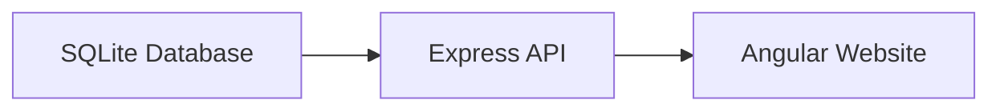
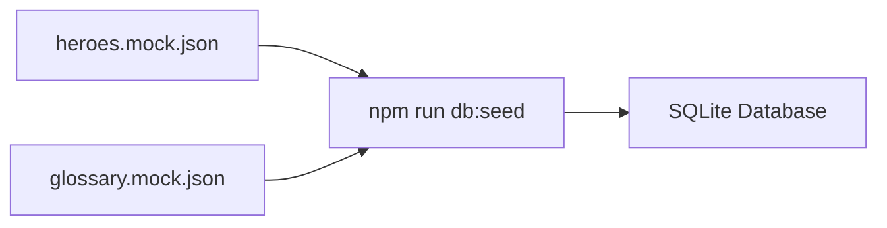
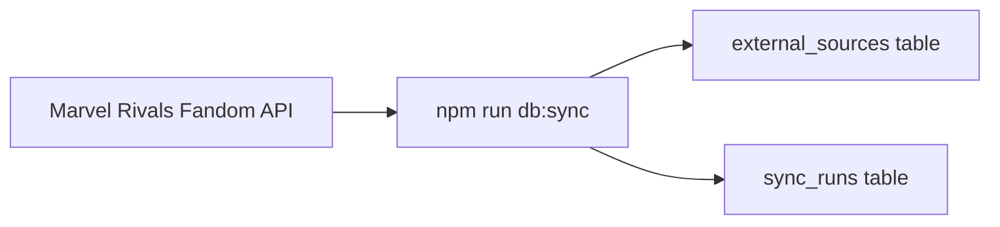
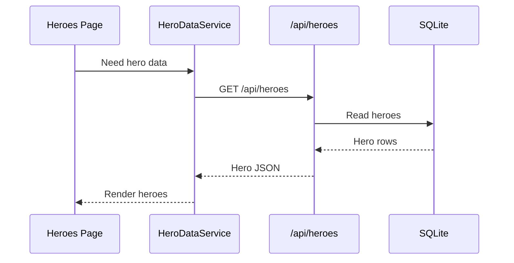
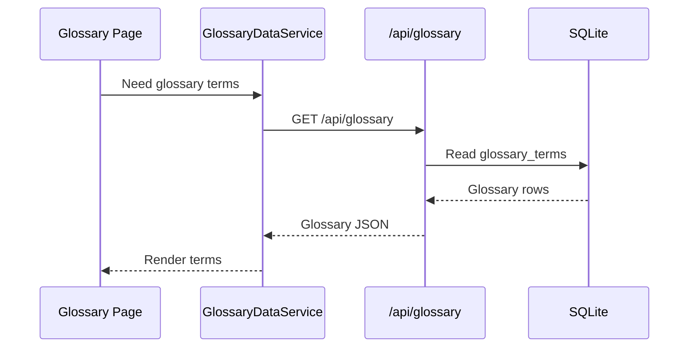
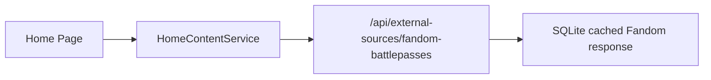

# Content Data Flow

This page explains where the site content comes from, where it is stored, and how the website reads it.

## Short Version

The website should read content from the SQLite database.



That is the main idea.

The JSON files and wiki API calls are used to fill or update the database.

## The Three Jobs

There are three separate jobs in the content system.

| Job | What It Does | Main Files |
| --- | --- | --- |
| Seed | Copies local JSON data into SQLite | `scripts/seed-sqlite.mjs` |
| Sync | Fetches outside data from Fandom/wiki APIs | `scripts/sync-external-sources.mjs` |
| Read | Lets Angular pages get data from SQLite | `src/server.ts`, `src/content-database.ts` |

## 1. Seed Data

Seed data is your starting content.

These files are seed data:

- `src/app/data/heroes.mock.json`
- `src/app/data/glossary.mock.json`

They are not the main runtime source anymore.

When you run:

```bash
npm run db:seed
```

the seed script copies those JSON files into SQLite.



After that, the website reads from SQLite, not directly from those JSON files.

## 2. Wiki/API Sync

Some data comes from outside sources, like the Marvel Rivals Fandom API.

When you run:

```bash
npm run db:sync
```

the sync script fetches external data and saves the raw response in SQLite.



Right now the sync script stores these external sources:

- `fandom-battlepasses`
- `fandom-deadpool`
- `fandom-deadpool-abilities-template`

The `sync_runs` table keeps a history of whether each update worked or failed.

## 3. Website Reads

When a user opens a page, Angular asks the Express API for content.

For heroes:



For glossary:



## What Each Piece Means

### SQLite Database

The local content database is:

```text
data/marvel-rivals-coach.db
```

It stores heroes, abilities, glossary terms, and cached external API responses.

### Express API

The Express server exposes database data through routes:

```text
GET /api/heroes
GET /api/heroes/:id
GET /api/glossary
GET /api/external-sources/:sourceKey
GET /api/content/status
```

These routes are defined in:

```text
src/server.ts
```

They read the database through:

```text
src/content-database.ts
```

### Angular Services

Angular pages should not read SQLite directly.

They use services:

```text
HeroDataService -> GET /api/heroes
GlossaryDataService -> GET /api/glossary
```

The services then give the page data to display.

## Update Commands

Use this when you changed local JSON seed files:

```bash
npm run db:seed
```

Use this when you want to refresh external wiki/API data:

```bash
npm run db:sync
```

Use this when you want to do both:

```bash
npm run content:update
```

## Current Status

Already database-backed:

- Heroes page
- Glossary page

Still needs cleanup:

- Home page battle pass/news data

The home page still has a direct Fandom call in `HomeContentService`. The cleaner version is:



That would make the home page use the same database-backed flow as the rest of the site.

## Mental Model

Think of it like this:

```text
JSON files and wiki APIs fill the database.
The database feeds the API.
The API feeds the Angular pages.
```

Or shorter:

```text
Sources -> SQLite -> API -> Website
```
